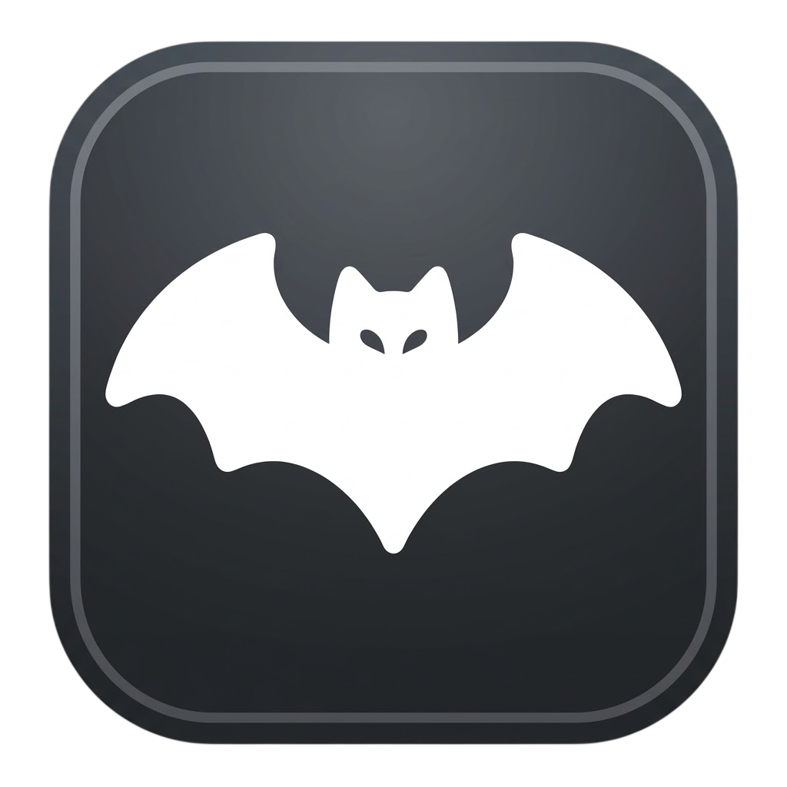

<div align="center">



# BatPlayer

**A minimalist music player for Windows with SoundCloud, VK Music, Yandex Music and Spotify support.**

[](https://github.com/xdxdsadness/BatPlayer/actions/workflows/ci.yml)
[](https://github.com/xdxdsadness/BatPlayer/releases)
[](LICENSE)

[](https://dotnet.microsoft.com/download/dotnet/8.0)

</div>

---

## About

BatPlayer is a native WPF application (.NET 8) that combines a local music library with
streaming platforms in a single interface: one player, one queue, one history — for your
own files and for your SoundCloud likes, VK Music, Yandex Music and Spotify libraries.

Where a platform refuses to serve audio, the player degrades gracefully: local match,
then the platform's disk cache, then the platform stream. A built-in, fully automatic
DPI-bypass engine restores access to blocked services without any VPN.

## Features

- **Local library** — SQLite-backed collection with covers, playlists, history and listening stats
- **SoundCloud** — search, likes sync, streaming; automatic reupload search for DRM-locked tracks
- **VK Music / Yandex Music / Spotify** — authorization, library import, streaming with disk caches
- **Built-in DPI bypass** — packet-level engine (WinDivert) that picks the best working
  preset automatically; no UI, one UAC prompt per session
- **Equalizer** — 10-band, with custom presets
- **Playback** — WASAPI shared/exclusive output, gapless, crossfade, volume normalization,
  waveform visualization
- **UX** — global hotkeys, tray, themes with accent colors, GIF backgrounds, RU/EN localization

## Getting started

### Download

Grab `BatPlayer-Setup-1.0.0.exe` from the [Releases](https://github.com/xdxdsadness/BatPlayer/releases)
page and run it — the installer is per-user (no admin rights) and creates the desktop shortcut.

### Build from source

Requirements: Windows 10 1903+ and the [.NET 8 SDK](https://dotnet.microsoft.com/download/dotnet/8.0).

```bash
git clone https://github.com/xdxdsadness/BatPlayer.git
cd BatPlayer

# run in development mode
dotnet build
dotnet run --project src/BatPlayer/BatPlayer.csproj

# or produce the distributable
dotnet publish src/BatPlayer/BatPlayer.csproj -c Release -r win-x64 --self-contained true -o publish
```

### Run tests

```bash
dotnet test
```

## Project structure

```
BatPlayer.sln
+-- src/BatPlayer/            application (WPF, MVVM)
|   +-- Audio/                playback engine (NAudio, WASAPI, EQ, resampling)
|   +-- Controls/             reusable controls (virtualizing grid, waveform, lazy covers)
|   +-- Database/             SQLite repositories (Dapper)
|   +-- Helpers/              pure logic helpers (matching, shuffling, runtime tracks)
|   +-- Models/               settings and domain models
|   +-- Services/             platform integrations, caches, DPI bypass
|   |   +-- Bypass/           automatic packet-level anti-blocking
|   |   +-- SoundCloud/       API, streaming, DRM reupload search
|   |   +-- Spotify/ Vk/ YandexMusic/
|   |   +-- ...
|   +-- ViewModels/           MVVM view models
|   +-- Views/                windows and pages
|   +-- Tools/                runtime tool binaries (not tracked by git)
+-- tests/BatPlayer.Tests/    unit tests (xUnit)
+-- docs/                     architecture, build, configuration, installer
+-- installer/                Inno Setup script
+-- assets/                   branding sources
```

## Tech stack

| Layer | Technology |
|---|---|
| UI | WPF, .NET 8, CommunityToolkit.Mvvm |
| Audio | NAudio (WASAPI), NAudio.Vorbis, NAudio.Flac |
| Storage | SQLite + Dapper |
| Web | HttpClient, WebView2 (login flows) |
| Metadata | TagLib# |
| Anti-blocking | WinDivert engine ([zapret](https://github.com/bol-van/zapret)) |

## Documentation

- [Architecture](docs/ARCHITECTURE.md)
- [Build](docs/BUILD.md)
- [Configuration](docs/CONFIGURATION.md)
- [Installer](docs/INSTALLER.md)
- [Extending](docs/EXTENDING.md)

## Contributing

Contributions are welcome — see [CONTRIBUTING.md](CONTRIBUTING.md).

## License

Distributed under the [MIT License](LICENSE).

## Acknowledgements

- [zapret](https://github.com/bol-van/zapret) and [zapret-discord-youtube](https://github.com/Flowseal/zapret-discord-youtube) — the packet-level bypass engine
- [WinDivert](https://reqrypt.org/windivert.html) — packet interception
- [NAudio](https://github.com/naudio/NAudio) — audio playback
- [CommunityToolkit.Mvvm](https://github.com/CommunityToolkit/dotnet) — MVVM infrastructure
